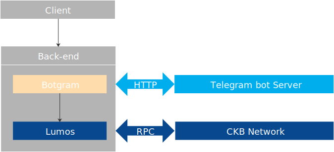
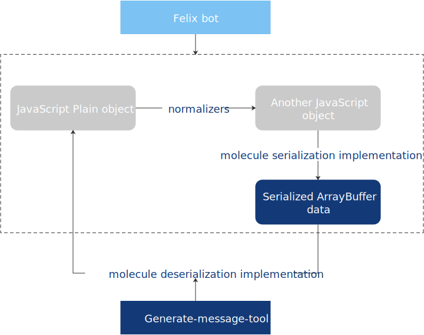

## Develop your first DApp on CKB layer1

### Related Concepts 
* Data Structures of Nervos CKB: Cell, Script, Transaction, see [A transfer transaction on CKB Testnet](rpc-and-transaction#a-transfer-transaction-on-ckb-testnet)
* State Generation and Verification,see [Generation offline Validation online](transfer-tx-dapp-demo#generation-offline-validation-online).
* There is a important principle for development on CKB layer1,see [Submit the minimal data](molecule#submit-the-minimal-data).
* Molecule serialization system on CKB, see [Use Molecule Serialization System](molecule#use-molecule-serialization).

### How to use Lumos
Lumos is an open-source framework that was developed by the Nervos Developer Tools team, for building Nervos CKB DApps.The transfer-tx DApp demo is based on Lumos functionalities to implement the most basic functions, see [Transfer-Tx DApp demo](transfer-tx-dapp-demo).

### A DApp demo on CKB layer1: Felix bot
Felix bot is a telegram bot, created upon botgram and lumos. You can use felix bot to interact with CKB layer1, send CKBytes red envelopes in a telegram chat group.In the process of the felix bot DApp development,you can more intuitively understand the interaction between the client, back-end and CKB layer1,see [Felix bot DApp demo](felix-bot).

     
Figure 4 the architecture of felix bot.

### How to use Molecule Serialization System
Molecule, as a widely used data structure in CKB, has its unique property that memory consumption could be minimized. For more information about the molecule format and the implementations of serialization and deserialization by molecule, see [Use Molecule Serialization System](molecule).

     
Figure 9 molecule serialization implementation and molecule serialization implementation.

## Stay tuned

### Mercury

Mercury is a tool that handles applications development on CKB. It is like the bridge between CKB and applications. It provides useful RPC services for DApps that are built upon Lumos, see [Mercury README](https://github.com/nervosnetwork/mercury#readme).

### Godwoken

If you are an Ethereum DApp developer and now want to develop on CKB,you don't have to abandon the previous development habits, see [Generation offline Validation online](transfer-tx-dapp-demo#generation-offline-validation-online).

Godwoken,as a CKB layer2 solution, is a generic framework to build rollup solutions upon Nervos CKB,see [godwoken](https://github.com/nervosnetwork/godwoken). In addition,godwoken-polyjuice, an Ethereum compatible backend for godwokenrollup framework, see [godwoken-polyjuice](https://github.com/nervosnetwork/godwoken-polyjuice). The solution is just for you. Because of the “VM on VM” scheme, an EVM implementation is running on CKB-VM, you can develop or run Ethereum DApps on CKB network. the detailed development documentations is also coming online, stay tuned...

Now A hackathon is ongoing and Nervos Fundation is one of the sponsors,see [Gitcoin hackathon](https://gitcoin.co/hackathon/nervos?org=nervosnetwork). Welcome to join the hackathon! 
## References

* Documentations
    * [Nervos Document Website](https://docs.nervos.org/): The Nervos documentation website.
    * [Lumos-doc](https://cryptape.github.io/lumos-doc/): Provide an understanding of Lumos.
    * [Nervos Network RFCs](https://github.com/nervosnetwork/rfcs): Include proposals, standards and documentations related to Nervos Network.
* Tools
    * [Tippy](https://github.com/nervosnetwork/tippy): A tool that helps set up and manage CKB nodes.
    * [CKB-CLI](https://github.com/nervosnetwork/ckb-cli): A CKB command line tool written in Rust.
    * [CKB-JS-Toolkit](https://github.com/nervosnetwork/ckb-js-toolkit): JavaScript toolkit for Nervos CKB. 
    * [Molecule](https://github.com/nervosnetwork/molecule): The serialization system used on CKB.
    * [CKB system scripts](https://github.com/nervosnetwork/ckb-system-scripts): The system scripts included in the system cells created by the genesis block.
    * [Mercury](https://github.com/nervosnetwork/mercury): A tool that handles applications development on CKB.
* Blogs
    * [Jan Xie's medium blog](https://medium.com/@janhxie): Introduce the Nervos Network architecture design.
    * [Xuejie's space](https://xuejie.space/): Introduce Nervos CKB Programing model.

## Contact & Support

If you find issues with the document site or have suggestions on how to improve the documentation, please [file an issue](https://github.com/zengbing15/implement-dapp-docs) for me, or send a email at [zengb@cryptape.com](mailto:zengb@cryptape.com).

If you run into issues with Nervos CKB, you can create a post on  [Nervos Talk](https://talk.nervos.org/)  or join [Discord](https://discord.com/invite/AqGTUE9). Welcome to contact with us!