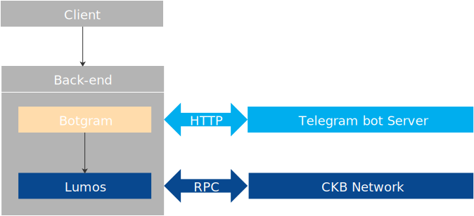

Now you have learned the basic knowledge of DApps development on CKB Layer1 with lumos. It's time to develop a slightly more complex DApp demo.    

Felix bot is a telegram bot, created upon [botgram](https://github.com/botgram/botgram) and lumos. You can use felix bot to interact with CKB Layer1, send CKBytes red envelopes in a telegram chat group.In the development process,you can more intuitively understand the interaction between the client, back-end and CKB Layer1.

     
Figure 4 the architecture of felix bot

## Project Structure

The full code of felix bot dapp demo can be found [here](https://github.com/zengbing15/felix). Clone and open the project you will see the following files:

```bash
$ git clone https://github.com/zengbing15/felix.git
$ cd felix
```

```
felix
├── lib
│   ├── data.js
│   ├── server.js
│   └── utils.js
├── schema
│   ├── UnsignedTransaction.mol
│   ├── UnsignedTransaction.json
│   ├── UnsignedTransaction.js
│   └── UnsignedTransaction.umd.js
├── package.json
├── .gitignore
└── README.md
```

## Prerequisites

### Set up the Development Environment

See [Set Up the Development Environment](https://cryptape.github.io/lumos-doc/docs/preparation/setupsystem).

### Prepare three CKB accounts

 Create three accounts: Alice, Bob and Charlie，see [Create CKB accounts](rpc-and-transaction#create-ckb-accounts). The payer is Bob and the recipient is Alice.

### Specify Alice as the miner

see [Step 5. Get CKB capacity for the account of Alice](https://cryptape.github.io/lumos-doc/docs/reference/ckbaccount#step-5-get-ckb-capacity-for-the-account-of-alice)

### Use CKB-CLI  to transfer some CKBytes to Bob

```bash
$ ckb-cli --from-account <alice lock_arg> --to-address <bob address> --capacity <transfer amount> --tx-fee <0.01(defualt value)>
```
### Set up a telegram bot

* Create a telegram bot, see [3. How do I create a bot?](https://core.telegram.org/bots#3-how-do-i-create-a-bot)
* Send a list of commands to `BotFather`

```
start - start
help - help
set_receiving_address - Set receiving address
receiving_address - Get receiving address
pending_envelopes - List of pending envelopes sent by me
pay - Pay an envelope
send - send envelopes
```

## Run the felix bot

### Install dependencies

```bash
$ npm install
```

### Set up the proxy server

```bash
export https_proxy=http://127.0.0.1:10080;export http_proxy=http://127.0.0.1:10080;export all_proxy=socks5://127.0.0.1:10081
```

### Set up the BOT_TOKEN

```bash
$ export BOT_TOKEN=<BOT_TOKEN>
```


## Set up the Configuration for Lumos

The act of sending a red packet is actually transferring CKBytes which means a transfer transaction. You can use lumos to implement the transfer transaction, see [Transfer-Tx DApp demo](transfer-tx-dapp-demo).

Set up the configure manager and indexer of lumos first.

```javascript title="/felix/lib/server.js"
const { Indexer } = require("@ckb-lumos/indexer");
const { initializeConfig, getConfig } = require("@ckb-lumos/config-manager");
process.env.LUMOS_CONFIG_FILE = process.env.LUMOS_CONFIG_FILE || './config.json'
initializeConfig();
const CKB_CONFIG = getConfig();

process.env.LUMOS_CONFIG_FILE = process.env.LUMOS_CONFIG_FILE || './config.json'
initializeConfig();
const CKB_CONFIG = getConfig();

const CKB_RPC_URI = process.env.CKB_RPC_URI || "http://127.0.0.1:8114";
const CKB_INDEXER_DATA = process.env.CKB_INDEXER_DATA || "./indexer-data";
const indexer = new Indexer(CKB_RPC_URI, CKB_INDEXER_DATA);
indexer.startForever();
```
For a sender, you can 

* Send a red envelope, The number of `remaining` can't be exceeding the number of this chat group members.

      
Figure 5 send a evelope

For a grabber, you can

* Set your receiving address: Charlie’s address
* Grab the red envelope

   
Figure 6 set the receiving address and grab the red envelope


## Confirm the receiving address  
> The prefix of "ckt" is means that the address is created on CKB testnet, see [Address and Lock Script](rpc-and-transaction#address-and-lock-script)

Use [parseAddress](https://nervosnetwork.github.io/lumos/modules/helpers.html#parseaddress) in `@ckb-lumos/helpers`to confirm the address.`CKB_CONFIG.PREFIX` means that the address prefix that should be entered. 


```javascript {6} title="/felix/lib/server.js"
const {parseAddress} = require("@ckb-lumos/helpers");

  [DATA_RECEIVING_ADDRESS]: async (session, msg, reply) => {
    const address = msg.text || "";
    try {
      parseAddress(address);
    } catch (e) {
      console.log(`Error parsing address: ${e}`);
      reply.text(
        `Please use a valid CKB address that starts with ${CKB_CONFIG.PREFIX}!`
      );
      return DATA_RECEIVING_ADDRESS;
    }
    await storage.put(`address:${msg.from.id}`, address);
    reply.text(`Setting your receiving address to ${address}!`);
    return null;
  },
```
When the grabber grabs the red envelope,felix bot can get the grabber's `user.id` and `address`.

```javascript title="/felix/lib/data.js"
  async grab(receiverId, storage) {
    if (this.remaining() <= 0) {
      throw new Error("You are too late!");
    }
    if (this.receivers.find((receiver) => receiver.id === receiverId)) {
      throw new Error("You have already grabbed one!");
    }
    let address;
    try {
      address = (await storage.get(`address:${receiverId}`)).toString();
    } catch (e) {
      throw new Error("Please click on me, and set your receiving address in a private chat!");
    }
    this.receivers.push({
      id: receiverId,
      address,
    });
  }
```
For a sender , you can 

* Select a envelope to pay
* Enter the CKBytes to pay for the red envelope
* Enter the address used to pay for the red envelope: Bob’s address

    
Figure 7 pay the envelope


## Build the transaction skeleton

Now enough information is obtained for the transfer transaction:the accounts info of two transaction parties and transfer amount.You can build the transaction skeleton:

* Create a transaction skeleton
* Add the transaction fee
* Prepare the signing entries 

```javascript title="/felix/lib/server.js"
let txSkeleton = TransactionSkeleton({ cellProvider: indexer });
    const fromInfos = [fromAddress]
......

      txSkeleton = await common.transfer(
        txSkeleton,
        fromInfos,
        receiver.address,
        currentAmount + BigInt(61) * SHANNONS,
      );
    }
    //use `payFeeByFeeRate` to set dynamic tx fee
    txSkeleton = await common.payFeeByFeeRate(
      txSkeleton, 
      fromInfos, 
      FEE_RATE,
      );
    txSkeleton = common.prepareSigningEntries(txSkeleton);
```

## Sign the transaction offline

For security,transaction assembling and transaction signing should be separated. Felix bot is replyed the signing message.It’s recommended to use [CKB-CLI](https://github.com/nervosnetwork/ckb-cli) to generate the signature by the signing message. 

   
Figure 8 reply the message


```javascript title="/felix/lib/server.js"
    const signingInfos = txSkeleton
      .get("signingEntries")
      .map((e) => {
        const lock = txSkeleton.get("inputs").get(e.index).cell_output.lock;
        const address = generateAddress(lock);
        return `Address: ${address}\nMessage: ${e.message}`;
      })
      .toArray()
      .join("\n");
    reply.text(
      `Please sign the following messages required by the transaction:\n\n${signingInfos}\n\nSignatures must be in hex string format with 0x prefix, each different signature should occupy its own line.`
    );
    return DATA_PAY_SIGNING;
  },
```


For a grabber, you can

* Sign the transaction

Use ckb-cli to sign the transaction.

* The CKB pre-built installer package includes the ckb-cli tool, see [Download the CKB pre-built installer package](https://cryptape.github.io/lumos-doc/docs/reference/ckbnode/#step-1-download-the-ckb-pre-built-installer-package). 
* generate the signature 

```bash
$ ckb-cli util sign-message --recoverable --from-account <bob lock_arg> --message <signing message>
```

An example of a signature output：

```json
Password: 
path: m
recoverable: true
signature: 0xd75d630994f862b43c52dc5dfd22306b9fec4112e751a5daf40fef7da0db05d7506a3494b63d7546dbdd2ea93af61f939d162fe7b8fe45da3ef929493a22762600
```

## Seal the transaction with the generated signature

For a grabber, you can

* Commit the generated signature to felix bot.

```javascript title="/felix/lib/server.js"
 [DATA_PAY_SIGNING]: async (session, msg, reply) => {
    const envelope = session[DATA_PAY];
    const amount = session[DATA_PAY_AMOUNT];
    const txSkeleton = session[DATA_PAY_ADDRESS];

    console.log(JSON.stringify(txSkeleton,null,2));

    const signatures = (msg.text || "").split("\n");
    let tx;
    try {
      tx = sealTransaction(txSkeleton, signatures);
    } catch (e) {

      console.log(`Error sealing transaction: ${e} stack: ${e.stack}`);
      reply.text("Invalid signatures!");
      return DATA_PAY_SIGNING;
    }   
```

## Send the finalized transaction to the CKB network

```javascript title="/felix/lib/server.js"
    const txHash = await rpc.send_transaction(tx);

    reply.text(`Envelope successfully paid! TX hash: ${txHash}`);
    delete session[DATA_PAY];
    delete session[DATA_PAY_AMOUNT];
    delete session[DATA_PAY_ADDRESS];
```

Felix bot will reply the transaction hash and `UnsignedTx.json` file.

   
Figure 8 reply tx_hash and UnsignedTx.json file.

