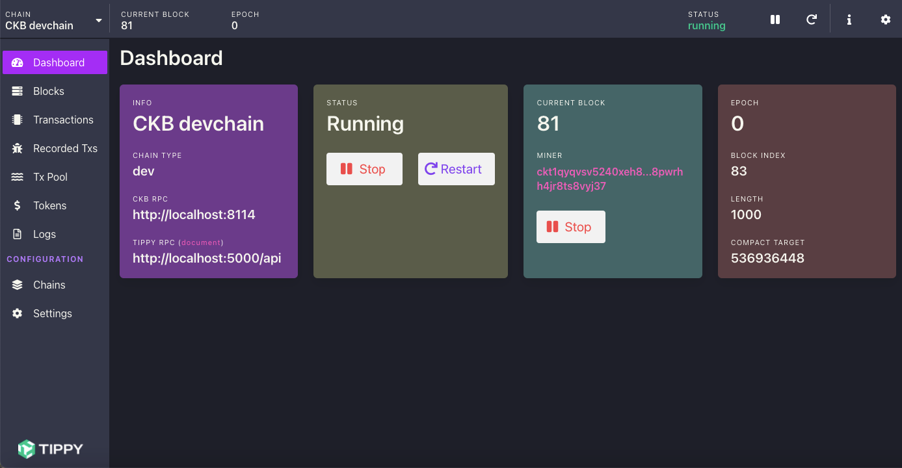
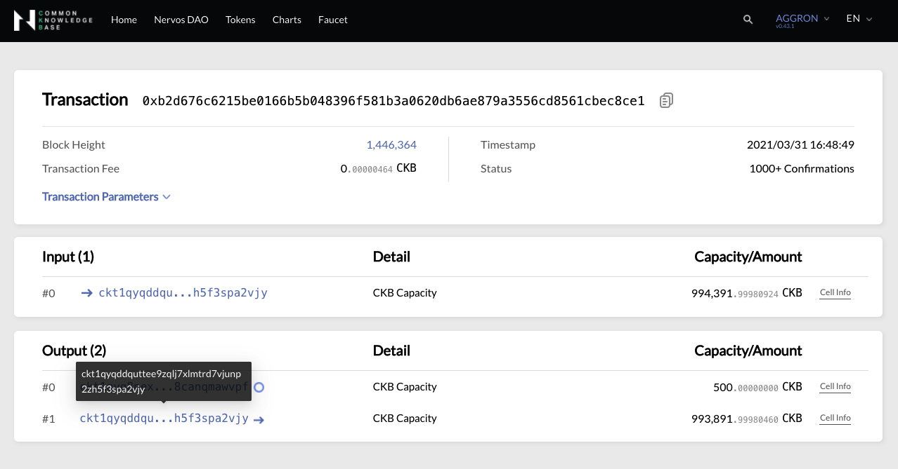
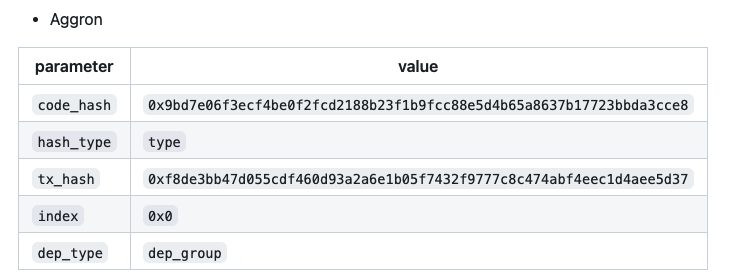

## What's the difference between DApp and Web App?

I'm sure you already have the skills to develop web apps (probably more than I do).
To help you understand DApps, let's take a look at the differences between DApps and Apps.

:::note
The DApps mentioned in this doc site are all DApps running on CKB layer1. Due to the uniqueness of Nervos CKB network, DApps are developed in a very different way than DApps on other blockchains, especially Ethereum, so please empty your cup first.
:::

APP 
* Client 
* Send requests through HTTP 
* Back-end: write programs that respond to requests.
* Web server, such as nginx/apache

DApp
* Client 
* Send requests through RPC
* Back-end: send transactions that respond to requests.
* CKB network 

The client side of web app and DApps are almost the same, you should focus on the implementation of back-end and RPC, so let's look through RPC and transaction first.

## RPC

First run a CKB node,then use @ckb-lumos/rpc (the RPC component in [Lumos](https://github.com/nervosnetwork/lumos)) to interact with CKB network，communicating block and transaction information with CKB nodes.

:::info
Lumos is a very handy development tool. CKB DApps can be developed upon lumos. [A transfer-tx DApp demo](transfer-tx-dapp-demo) will introduce how to develop DApps upon lumos step by step. 
:::

### Set Up the Development Environment 

See [Set Up the Development Environment](https://cryptape.github.io/lumos-doc/docs/preparation/setupsystem),then you will run a CKB node on Dev Chain by using [Tippy](https://github.com/nervosnetwork/tippy).

An example of Tippy's dashboard 



###  Connect to CKB node through RPC

```bash
$ yarn add @ckb-lumos/rpc
```

Get the blockchain info

```javascript 
const { RPC } = require("@ckb-lumos/rpc");
const rpc = new RPC("http://localhost:8114");
async function main(){
    const result = await rpc.get_blockchain_info();
    console.log(result);
}
main();
```

An example of the blockchain info:

```json
  alerts: [],
  chain: "ckb_dev",
  difficulty: "0x100",
  epoch: "0x64005b0000bc",
  is_initial_block_download: false,
  median_time: "0x17b9c952a1d"
```  

The full code of the example can be found [here](https://github.com/zengbing15/simple-dapp-demo/tree/main/call-rpc).

Great! Now you have got your foot in the door! 

## A transfer transaction on CKB Testnet

At its core, a blockchain is a [replicated deterministic state machine](https://en.wikipedia.org/wiki/State_machine_replication).A state machine is a computer science concept whereby a machine can have multiple states, but only one at any given time. There is a state, which describes the current state of the system, and `transactions`, that trigger state transitions.Given a state S and a transaction T, the state machine will return a new state S'.

```
+--------+                 
|        |                 
| State  |  
|        |             
+--------+                 
    |
    | transactions
    |
+--------+                 
|        |                 
| State' |  
|        |             
+--------+ 

```

Nervos CKB Layer1 also follows this logic, the following is a transfer transaction on CKB Aggron Testnet, the following is the state transition triggered by the transfer transaction:

* The payer's address：ckt1qyqddquttee9zqlj7xlmtrd7vjunp2zh5f3spa2vjy
* The recipient's address：ckt1qyqv70xf5cusptp0gwzqj8ewsen7j2c0aa8sq5d7y6

An example of transfer transaction on CKB Aggron Testnet

```json
{
  "version": "0x0",
  "cell_deps": [
    {
      "out_point": {
        "tx_hash": "0xf8de3bb47d055cdf460d93a2a6e1b05f7432f9777c8c474abf4eec1d4aee5d37",
        "index": "0x0"
      },
      "dep_type": "dep_group"
    }
  ],
  "header_deps": [],
  "inputs": [
    {
      "since": "0x0",
      "previous_output": {
        "tx_hash": "0xb2d676c6215be0166b5b048396f581b3a0620db6ae879a3556cd8561cbec8ce1",
        "index": "0x1"
      }
    }
  ],
  "outputs": [
    {
      "capacity": "0x56cc9c900",
      "lock": {
        "code_hash": "0x9bd7e06f3ecf4be0f2fcd2188b23f1b9fcc88e5d4b65a8637b17723bbda3cce8",
        "hash_type": "type",
        "args": "0xcf3cc9a63900ac2f4384091f2e8667e92b0fef4f"
      }
    },
    {
      "capacity": "0x5a5f6d2bccdc",
      "lock": {
        "code_hash": "0x9bd7e06f3ecf4be0f2fcd2188b23f1b9fcc88e5d4b65a8637b17723bbda3cce8",
        "hash_type": "type",
        "args": "0xd6838b5e725103f2f1bfb58dbe64b930a857a263"
      }
    }
  ],
  "outputs_data": [
    "0x",
    "0x"
  ],
  "witnesses": [
    "0x550000001000000055000000550000004100000078aa17dc603d72b8dcd7d214f9a6e4bb4bbf6c77f172a66d889f3958aa16f8a812e6b7d3e3ed56f361d255b7a834bdbc2e69442da536e2ae7a0b3feffa2b556f01"
  ]
}
```

The transaction JSON code looks a bit complicated, don't panic, let's look through `Inputs and Outputs` first. 


### Inputs and Outputs

```json {10-27}
"inputs": [
    {
      "since": "0x0",
      "previous_output": {
        "tx_hash": "0xb2d676c6215be0166b5b048396f581b3a0620db6ae879a3556cd8561cbec8ce1",
        "index": "0x1"
      }
    }
  ],
  "outputs": [
    {
      "capacity": "0x56cc9c900",
      "lock": {
        "code_hash": "0x9bd7e06f3ecf4be0f2fcd2188b23f1b9fcc88e5d4b65a8637b17723bbda3cce8",
        "hash_type": "type",
        "args": "0xcf3cc9a63900ac2f4384091f2e8667e92b0fef4f"
      }
    },
    {
      "capacity": "0x5a5f6d2bccdc",
      "lock": {
        "code_hash": "0x9bd7e06f3ecf4be0f2fcd2188b23f1b9fcc88e5d4b65a8637b17723bbda3cce8",
        "hash_type": "type",
        "args": "0xd6838b5e725103f2f1bfb58dbe64b930a857a263"
      }
    }
  ],
  "outputs_data": [
    "0x",
    "0x"
  ],
```

You may find that there are two objects in the `outputs` that are similar in structure (put aside the `inputs` now).

You got it!  This is called `Cell` which is the best design about Nervos CKB!

### Cell 

Cells are the primary state units in CKB, so the state transition can be represented as follows:

```
+--------+                 
|        |                 
| Cells  |  
|        |             
+--------+                 
    |
    | transfer transaction
    |
+--------+                 
|        |                 
| Cells' |  
|        |             
+--------+  

```

 A cell has the following fields:

```jsx
Cell: {
 //field name: type
   capacity: Uint64
   lock: Script
   type: Script
   data: Bytes
   } 
```

* **capacity：**Size limit of the cell, also the number of native tokens owned by the cell.
* **lock：**If you think of Cell as a box，it's a lock of the box. Every cell has a lock script.
* **type:** Another type of lock with different uses，it's optional.
* **data:** State data stored in this cell, could be any format.
  * `outputs_data`: The actual data are kept separated for the ease of CKB script handling and for the possibility of future optimizations.


You will find a field called `"previous_output"` in `inputs`

```json {5-6}
"inputs": [
    {
      "since": "0x0",
      "previous_output": {
        "tx_hash": "0xb2d676c6215be0166b5b048396f581b3a0620db6ae879a3556cd8561cbec8ce1",
        "index": "0x1"
      }
    }
  ],
```

The field's name have been fully expressed: `inputs`is the `previous_output`. The `inputs` can be indexed through `tx_hash` and `index`.If you open [CKB-Explorer](https://explorer.nervos.org/aggron/transaction/0xb2d676c6215be0166b5b048396f581b3a0620db6ae879a3556cd8561cbec8ce1) (switch to `AGGRON`) ，Search for `tx_hash`, you will find the `inputs`with the similar address of the payer's address.

An Example usage of CKB-Explorer



In conclusion, the essence of the transaction is to spend some cells, and then generate some new cells, which will also become input cells that need to be spent in another transaction. The unspent cells are called live cells. This concepts are similar to that of [UTXO](https://en.wikipedia.org/wiki/Unspent_transaction_output) in Bitcoin's terminology. 


the state transition can be represented as follows:

```
+--------+                 
|        |                 
| Cell A |  
|        |             
+--------+                 
    |
    | transfer transaction
    |
+--------+                 
|        |                 
| Cell B |
| Cell C |
|        |             
+--------+  

```

### cell_deps and Witnesses

Come to `cell_deps` first, have you found out? `out_point` also made up of `tx_hash` and `index`, so    `cell_deps` is actually pointed to a cell with `tx_hash` and `index`, so what is this cell for?

```json {4-5}
  "cell_deps": [
    {
      "out_point": {
        "tx_hash": "0xf8de3bb47d055cdf460d93a2a6e1b05f7432f9777c8c474abf4eec1d4aee5d37",
        "index": "0x0"
      },
      "dep_type": "dep_group"
    }
  ],
```

[SECP256K1_BLAKE160](https://github.com/nervosnetwork/ckb-system-scripts/blob/master/c/secp256k1_blake160_sighash_all.c) is a piece of code using the same secp256k1 signature verification algorithm as used in bitcoin.It is the default lock script used to protect the ownership of each cell. 

There is one cell created in the genesis block and SECP256K1_BLAKE160 code is compiled and put in the `data` field of the cell. The transfer transaction should use it as `cell_deps` to protect cells in `inputs and outputs`.

The `tx_hash` and `index` are the same with [SECP256K1_BLAKE160 info](https://github.com/nervosnetwork/rfcs/blob/master/rfcs/0024-ckb-system-script-list/0024-ckb-system-script-list.md#locks).



The info of secp256k1 cell in Aggron Testnet.


### Lock Script

So what is the specific mode of operation?

The type of the lock script is `Script`， A cell has the following fields:

```jsx
Script: {
// field name: type
   code_hash: H256(hash)
   args: Bytes
   hash_type: String, could be `type` or `data`
   } 
```

The `hash_type` means that the interpretation of code hash when looking for matched dep cells. The default lock script should be `type`:

```
Lock Script: {
   code_hash: H256(hash)
   args: Bytes
   hash_type: `type`
   } 
```

Fill in `code_hash` with `dep_cell`'s code hash, also fill in `args` with the payer's public key hash. When the payer commits a transaction, TA should sign the transaction with private key, which is what `Witnesses` puts it on.

In this way,the SECP256K1 encryption algorithm with the public key and signature can figure out whether the transaction was committed by the corresponding private key, and also figure out whether the real owner is operating behind it.

The `code_hash` in the lock script are the same with `code_hash` in [SECP256K1_BLAKE160 info](https://github.com/nervosnetwork/rfcs/blob/master/rfcs/0024-ckb-system-script-list/0024-ckb-system-script-list.md#locks).


The info of secp256k1 cell in Aggron Testnet.

```json {15,23}
  "cell_deps": [
    {
      "out_point": {
        "tx_hash": "0xf8de3bb47d055cdf460d93a2a6e1b05f7432f9777c8c474abf4eec1d4aee5d37",
        "index": "0x0"
      },
      "dep_type": "dep_group"
    }
  ],
  ......
  "outputs": [
    {
      "capacity": "0x56cc9c900",
      "lock": {
        "code_hash": "0x9bd7e06f3ecf4be0f2fcd2188b23f1b9fcc88e5d4b65a8637b17723bbda3cce8",
        "hash_type": "type",
        "args": "0xcf3cc9a63900ac2f4384091f2e8667e92b0fef4f"
      }
    },
    {
      "capacity": "0x5a5f6d2bccdc",
      "lock": {
        "code_hash": "0x9bd7e06f3ecf4be0f2fcd2188b23f1b9fcc88e5d4b65a8637b17723bbda3cce8",
        "hash_type": "type",
        "args": "0xd6838b5e725103f2f1bfb58dbe64b930a857a263"
      }
    }
  ],
  "outputs_data": [
    "0x",
    "0x"
  ],
  "witnesses": [
    "0x550000001000000055000000550000004100000078aa17dc603d72b8dcd7d214f9a6e4bb4bbf6c77f172a66d889f3958aa16f8a812e6b7d3e3ed56f361d255b7a834bdbc2e69442da536e2ae7a0b3feffa2b556f01"
  ]
}
```
### Address and Lock Script

The last thing you need to understand is `Address` on CKB network.

On CKB network,an accont is a set of live cells with similar lock script. An address is packaged the lock script into a single line with verificable and human readable format. 
The prefix of "ckt" is means that the address is generated on CKB testnet, see [RFC: CKB Address Format](https://github.com/nervosnetwork/rfcs/blob/master/rfcs/0021-ckb-address-format/0021-ckb-address-format.md#ckb-address-format)

Therefore, an address is represented as an account. 
The relationship between private key, public key（args）, lock script, and CKB address is represented as follows：

```markdown
+-------------+                 
| private key | -----$\rightarrow$                 
+-------------+
```

[Image: image.png]


### Create CKB accounts 

You can use [CKB-CLI](https://github.com/nervosnetwork/ckb-cli) to generate accounts

* Prerequisites：[Run a CKB Node on DEV Chain by Using Tippy](https://cryptape.github.io/lumos-doc/docs/preparation/setupsystem)
* Step 1. [Download the CKB pre-built installer package](https://cryptape.github.io/lumos-doc/docs/reference/ckbaccount#step-1-download-the-ckb-pre-built-installer-package).
* Step 2. [Verify the ckb-cli tool is working and check the version](https://cryptape.github.io/lumos-doc/docs/reference/ckbaccount#step-2-verify-the-ckb-cli-tool-is-working-and-check-the-version).
* Step 3. [Create the account](https://cryptape.github.io/lumos-doc/docs/reference/ckbaccount#step-3-create-the-account-for-alice)
* Step 4. [Get the private key for the account](https://cryptape.github.io/lumos-doc/docs/reference/ckbaccount#step-4-get-the-private-key-for-the-account-of-alice)
* Step 5. [Get CKB capacity for the account](https://cryptape.github.io/lumos-doc/docs/reference/ckbaccount#step-5-get-ckb-capacity-for-the-account-of-alice)


This is the payer's account info：

```json {4}
address:
  mainnet: ckb1qyqddquttee9zqlj7xlmtrd7vjunp2zh5f3suc5n7c
  testnet: ckt1qyqddquttee9zqlj7xlmtrd7vjunp2zh5f3spa2vjy
lock_arg: 0xd6838b5e725103f2f1bfb58dbe64b930a857a263
lock_hash: 0x10f9a227094e77ee9149b3e8ed1e34f6d5c7c604bab81e0df42f13e1d33ac0fb 
```


This is the recipient's account info：

```json {4}
address:
    mainnet: ckb1qyqv70xf5cusptp0gwzqj8ewsen7j2c0aa8sa3npgx
    testnet: ckt1qyqv70xf5cusptp0gwzqj8ewsen7j2c0aa8sq5d7y6
  lock_arg: 0xcf3cc9a63900ac2f4384091f2e8667e92b0fef4f
  lock_hash: 0xc7cea924f48d069396b6826ee17653580d90d505544fa6940dbba3d24d9258ba
```

The `lock_arg` in the address is similar with the `args` in the `outputs`.

```json {7,15}
  "outputs": [
    {
      "capacity": "0x56cc9c900",
      "lock": {
        "code_hash": "0x9bd7e06f3ecf4be0f2fcd2188b23f1b9fcc88e5d4b65a8637b17723bbda3cce8",
        "hash_type": "type",
        "args": "0xcf3cc9a63900ac2f4384091f2e8667e92b0fef4f"
      }
    },
    {
      "capacity": "0x5a5f6d2bccdc",
      "lock": {
        "code_hash": "0x9bd7e06f3ecf4be0f2fcd2188b23f1b9fcc88e5d4b65a8637b17723bbda3cce8",
        "hash_type": "type",
        "args": "0xd6838b5e725103f2f1bfb58dbe64b930a857a263"
      }
    }
  ],
  "outputs_data": [
    "0x",
    "0x"
  ],
  "witnesses": [
    "0x550000001000000055000000550000004100000078aa17dc603d72b8dcd7d214f9a6e4bb4bbf6c77f172a66d889f3958aa16f8a812e6b7d3e3ed56f361d255b7a834bdbc2e69442da536e2ae7a0b3feffa2b556f01"
  ]
}
```

### Witnesses

In the transfer transaction case, the `Witnesses` just include signature which is generated by the payer's private key.

:::tip
if `lock script` is 0   

```json
Witnesses = List(["0x55000000100000005500000055000000410000000000000000000000000000000000000000000000000000000000000000000000000000000000000000000000000000000000000000000000000000000000000000"]);
```
:::


### Summary

The transfer transaction can be represented as follows:

```json
cell_deps:
  * point to the cell with SECP256K1 code

inputs: 
  * The payer's cell：point to previous_output

outputs:
  * the recipient's cell
    * capacity: 0x56cc9c900
    * lock script
        * SECP256K1 code hash
        * the recipient's public_key hash
    * data: 0x
  * the payer's cell
    * capacity: 0x5a5f6d2bccdc
    * lock script
        * SECP256K1 code hash
        * the payer's public_key hash
    * data: 0x

 witnesses:
    * include the payer's signature
```

### Sign the transfer transaction

We need the following arguments to sign the transfer transaction，this is the default signing solution used in CKB now. For more information,see [How to sign transaction](https://github.com/nervosnetwork/ckb-system-scripts/wiki/How-to-sign-transaction)

```
* public key, secp256k1 private key
* witnesses which include the signature
```

For more information about `version` ， `header_deps`，`since`, see [RFC: Data Structures of Nervos CKB](https://github.com/nervosnetwork/rfcs/blob/master/rfcs/0019-data-structures/0019-data-structures.md)